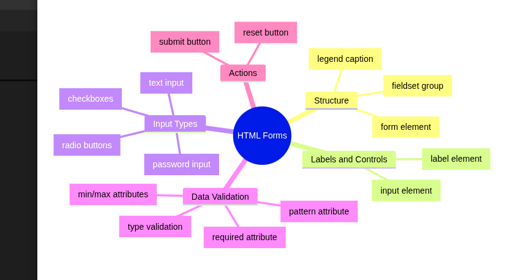

# Day 2 - HTML Forms




## 1. Introduction to Forms

The `<form>` element is used to collect user input and send data to a server.

### Syntax

```html
<form>
    <!-- form elements -->
</form>
```

### Example

```html
<form>
    <input type="text">
</form>
```

---

## 2. Text Input

The `text` input allows users to enter plain text.

### Example

```html
<input type="text" name="username">
```

### Common Uses

* Name
* Username
* City
* Address

---

## 3. Email Input

The `email` input accepts email addresses.

### Example

```html
<input type="email" name="useremail">
```

### Benefits

* Built-in email validation
* Mobile devices show email keyboard

---

## 4. Date Input

The `date` input allows users to select a date.

### Example

```html
<input type="date" name="birthday">
```

### Uses

* Date of Birth
* Appointment Date
* Event Date

---

## 5. Radio Buttons

Radio buttons allow users to choose only one option from a group.

### Example

```html
<input type="radio" name="gender" value="male">Male
<input type="radio" name="gender" value="female">Female
```

### Important

All radio buttons in the same group must have the same `name` attribute.

---

## 6. Checkboxes

Checkboxes allow users to select multiple options.

### Example

```html
<input type="checkbox" name="skill" value="html">HTML
<input type="checkbox" name="skill" value="css">CSS
<input type="checkbox" name="skill" value="javascript">JavaScript
```

### Uses

* Skills
* Interests
* Terms and Conditions

---

## 7. Label Element

The `<label>` element describes an input field.

### Example

```html
<label for="username">Name:</label>
<input type="text" id="username">
```

### Benefits

* Better accessibility
* Clicking the label focuses the input

---

## 8. Required Attribute

The `required` attribute makes a field mandatory.

### Example

```html
<input type="text" required>
```

### Result

The form cannot be submitted until the field is filled.

---

## 9. Pattern Attribute

The `pattern` attribute applies custom validation using Regular Expressions.

### Example

```html
<input
    type="text"
    pattern="[A-Za-z]{3}"
>
```

### Meaning

| Pattern | Meaning              |
| ------- | -------------------- |
| A-Z     | Capital letters      |
| a-z     | Small letters        |
| {3}     | Exactly 3 characters |

Valid:

* abc
* XYZ

Invalid:

* ab
* abcd
* 123

---

## 10. Title Attribute

The `title` attribute displays a validation message.

### Example

```html
<input
    pattern="[A-Za-z]{3}"
    title="Must be 3 letters"
>
```

---

## 11. Submit Button

The submit button sends form data.

### Example

```html
<button type="submit">
    Click Here!
</button>
```

---

## 12. Fieldset

`<fieldset>` groups related form elements.

### Example

```html
<fieldset>
    ...
</fieldset>
```

### Benefits

* Better organization
* Easier to read

---

## 13. Legend

The `<legend>` element provides a title for a fieldset.

### Example

```html
<fieldset>
    <legend>Personal Information</legend>
</fieldset>
```

---

## 14. Password Input

The password input hides characters while typing.

### Example

```html
<input type="password">
```

### Uses

* Login Forms
* Registration Forms
* Security Forms

---

## Key Concepts Learned

✔ Form Creation

✔ Text Input

✔ Email Input

✔ Date Input

✔ Radio Buttons

✔ Checkboxes

✔ Labels

✔ Required Validation

✔ Pattern Validation

✔ Submit Button

✔ Fieldset

✔ Legend

✔ Password Input

---

## Mini Project

Create a Student Registration Form containing:

* Name
* Email
* Date of Birth
* Gender
* Skills
* Password
* Submit Button

This project combines all Day 2 concepts into one form.
