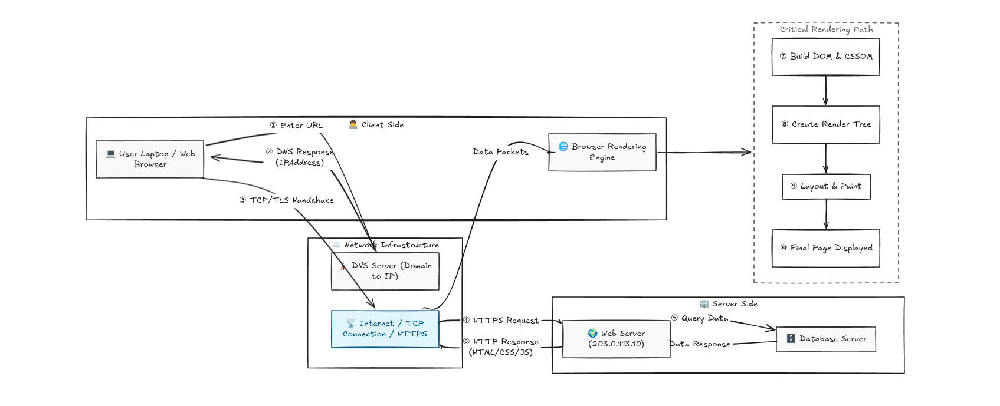

# 🌐 Web Fundamentals — Request–Response Cycle

<p align="center">
  A visual guide to understanding how browsers communicate with servers, resolve domains, transfer data securely, and render web pages.
</p>

<p align="center">
  
  
  
  
</p>

---

## 📖 Overview

Every time you open a website, a series of events happen behind the scenes in milliseconds.

This project explains the complete journey of a web request:

```text
URL → DNS → Server → Database → Response → Browser Rendering
```

By the end of this guide, you'll understand how the modern web works from start to finish.

---

## 📚 Topics Covered

* 🔄 Request–Response Cycle
* 🌍 DNS (Domain Name System)
* 🔒 HTTP vs HTTPS
* 🖥️ Client–Server Architecture
* 🎨 Critical Rendering Path
* 📡 IP Addresses & Ports

---

## 🖼️ Architecture Diagram

> 📌 Add your Excalidraw diagram here.




---

## 🚀 End-to-End Journey

```text
👨‍💻 User
   │
   ▼
🌐 Browser
   │
   ▼
🌍 DNS Resolver
   │
   ▼
📡 IP Address
   │
   ▼
☁️ Internet
   │
   ▼
🏢 Web Server
   │
   ▼
🗄️ Database
   │
   ▼
📄 HTML + 🎨 CSS + ⚡ JavaScript
   │
   ▼
🌐 Browser
   │
   ▼
🎨 Critical Rendering Path
   │
   ▼
🖥️ Screen
```

---

## 🔄 Request–Response Cycle

The **Request–Response Cycle** describes how a browser communicates with a server to fetch resources.

### 🪜 Step-by-Step Flow

1. User enters a URL.
2. Browser checks cache.
3. Browser performs DNS lookup.
4. Browser establishes a connection.
5. Browser sends an HTTP/HTTPS request.
6. Server processes the request.
7. Server returns a response.
8. Browser renders the page.

### 📋 Example Request

```http
GET / HTTP/1.1
Host: example.com
```

### 📋 Example Response

```http
HTTP/1.1 200 OK
Content-Type: text/html
```

---

## 🌍 DNS (Domain Name System)

DNS converts human-friendly domain names into machine-readable IP addresses.

### 💡 Example

```text
example.com → 93.184.216.34
```

### 🔍 DNS Resolution Process

1. Browser checks local cache.
2. Operating system checks DNS cache.
3. Request goes to DNS resolver.
4. Resolver finds the IP address.
5. Browser receives the IP.
6. Browser connects to the server.

---

## 🔒 HTTP vs HTTPS

HTTP and HTTPS define how clients and servers communicate.

| Feature              | HTTP | HTTPS |
| -------------------- | ---- | ----- |
| Port                 | 80   | 443   |
| Encryption           | ❌ No | ✅ Yes |
| Security             | Low  | High  |
| Certificate Required | ❌ No | ✅ Yes |

### 🔐 HTTPS Connection Flow

```text
Browser
   │
   ├── TCP Connection
   ├── TLS Handshake
   ├── Certificate Verification
   └── Secure Data Transfer
```

---

## 🖥️ Client–Server Architecture

The web follows a client–server model.

### 👨‍💻 Client

* Browser
* Mobile App
* Desktop Application

### 🏢 Server

* Web Server
* API Server
* Database Server

### 🔄 Communication

```text
Client ── Request ──► Server
Client ◄── Response ── Server
```

---

## 🎨 Critical Rendering Path

The browser follows these steps to display a webpage.

```text
HTML
 ↓
DOM
 ↓
CSS
 ↓
CSSOM
 ↓
Render Tree
 ↓
Layout
 ↓
Paint
 ↓
Composite
 ↓
Screen
```

### ⚙️ Rendering Steps

1. Parse HTML
2. Build DOM
3. Parse CSS
4. Build CSSOM
5. Create Render Tree
6. Calculate Layout
7. Paint Pixels
8. Composite Layers

> ⚡ Optimizing the Critical Rendering Path improves page performance.

---

## 📡 IP Addresses & Ports

An IP address identifies a device, while a port identifies a service running on that device.

### 🧩 Example

```text
203.0.113.10:443
```

* `203.0.113.10` → IP Address
* `443` → HTTPS Port

### 🔢 Common Ports

| Service | Port |
| ------- | ---- |
| HTTP    | 80   |
| HTTPS   | 443  |
| SSH     | 22   |
| FTP     | 21   |
| MySQL   | 3306 |

---

## 🛠️ Tools & Technologies

* Excalidraw
* Web Browser
* DNS
* HTTP/HTTPS
* HTML
* CSS
* JavaScript

---

## 🎯 Learning Outcomes

After completing this project, you will be able to:

* ✅ Explain the Request–Response Cycle
* ✅ Understand DNS resolution
* ✅ Differentiate HTTP and HTTPS
* ✅ Understand IP addresses and ports
* ✅ Explain the Client–Server model
* ✅ Describe the Critical Rendering Path

---

## 📚 Recommended Next Topics

* 🍪 Cookies & Sessions
* 🗂️ Browser Storage
* ⚡ Caching Strategies
* 🌐 CDN (Content Delivery Network)
* 🔑 Authentication & Authorization
* 🚀 REST APIs
* 🔌 WebSockets

---

<p align="center">
  Built with ❤️ to understand how the modern web works.
</p>
